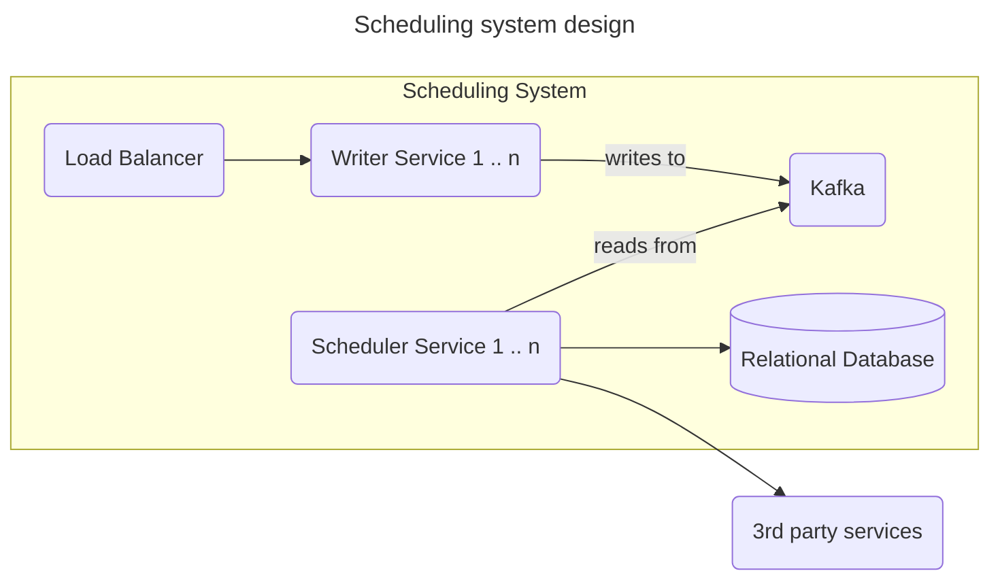
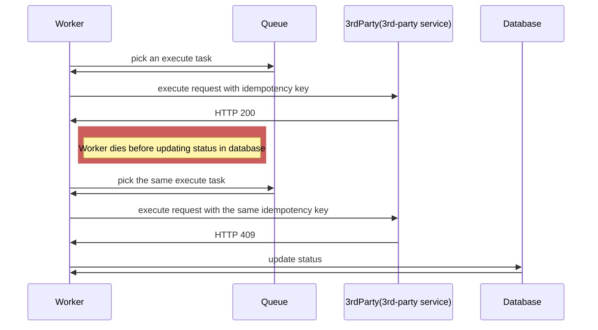

# Scheduling System

## Clarification
* What the minimal delay between scheduling request and execution?
* What the max number of concurrent request we might need to execute?
* How much delay between provided execution date time and actual execution is acceptable?
* Do we need to expose an http resource for checking status of execution task?

## Back of envelope calculation

To get the idea about what number of requests we will store for execution lets calculate how many requests per day will we receive:
10 rpm * 60 * 24 = 14400 requests per day

## High level design

The write volume is low therefore we will not be focusing on storing data in database here. It is not a problem and any database can handle even 1000 requests per minute.



### Components

**Writer Service** - Stateless HTTP service with Load Balancer in front. Responsible for sending requests for execution to Kafka topic.

**Scheduler Service** - Each instance reads from Kafka's topic and store the requests in database. Before writing to db it would check the time of execution. If the execution should happen within next x minutes it would additionally store the request to a local cache. This way we would not need to spend time querying database every minute to find requests that need to be executed. Instead we keep "soon to be executed" requests in memory and add to it periodically (how often would depend on x).

**Database** - Relational database like Postgresql. The schema would look like this:
```roomsql
create table execution_tasks(
    id BIGINT,
    partition_id INT,
    idempotency_key UUID,
    url TEXT,
    execution_scheduled_at TIMESTAMP,
    body TEXT,
    status TEXT,
    created_at, TIMESTAMP,
    updated_at TIMESTAMP
); 
```

## Writing interface

We will assume here we need support all HTTP verbs. Our interface will look as described below:

`HTTP POST https://myservice.com/schedule`

Body:
```json
{
  "url": "https://service-to-call.com/path/to/call",
  "verb": "PUT",
  "body": "{\"param1:\" 11, \"param2\": [33.4, 12.0, 54.134]}",
  "executionDateTime": ""
}
```

## Timezone handling

On API layer we would allow clients to define when request needs to be executed by providing date and time with timezone (by default we would use their current timezone).

On the database we would store everything using UTC. The transformation could happen either on backend or on database (many databases like Postgresql have types `with timezone` which accepts date time with timezone and transform it into UTC or server default timezone).

If we allow reading existing tasks (for example to check status of execution) we would return UTC based timestamp and allow client to convert to current user's timezone. 

## Handling of crashes and duplication

Its worth noting that unless 3rd-party services which we will be calling support some sort of idempotency key for write operations then we cannot do much about avoiding duplicated calls. The problem here is a matter of distributed transaction which cannot be guaranteed. 

### Duplication problem

The processing of http execution task can be interrupted at any point. The interruption can happen after we call 3rd-party service but before we have a chance to go to database and update the status of the task. The reason for interruption might be problem with connectivity to database or even a crash of our worker. The only way to prevent double processing is using idempotency key. The key is unique for every task and always passed to 3rd-party service. When received service first checks if the request was already executed and if so it return information about it without performing any logic. If the idempotency key is new then it is stored in database and request is properly handled.

### With idempotency key



## Other topics to talk about
* How does Kafka work?
* How to defend Scheduler Service from slow \ unresponsive services that it needs to call?

## Additional resources
* ["Building a Distributed Task Scheduler With Akka, Kafka, and Cassandra" by David van Geest
  ](https://www.youtube.com/watch?v=s3GfXTnzG_Y) (which was inspiration for this design)
* [Kafka documentation](https://kafka.apache.org/20/documentation.html#gettingStarted)
