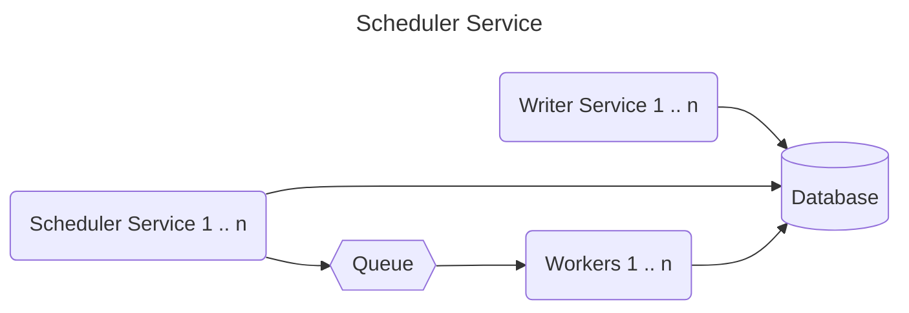

# Scheduling System

## Clarification
* Whats the time window within which it is acceptable to execute the requests? Is it 1 or 5 minutes? Or do they all need to be executed exactly on Sunday 12:00?
* Whats p99 response time for the service we will be calling?
* What the minimal delay between scheduling request and execution?

## High level design

### Simple approach

### Alternative 1

### Alternative 2

## Writing interface

## Timezone handling

## Handling of crashes and duplication

