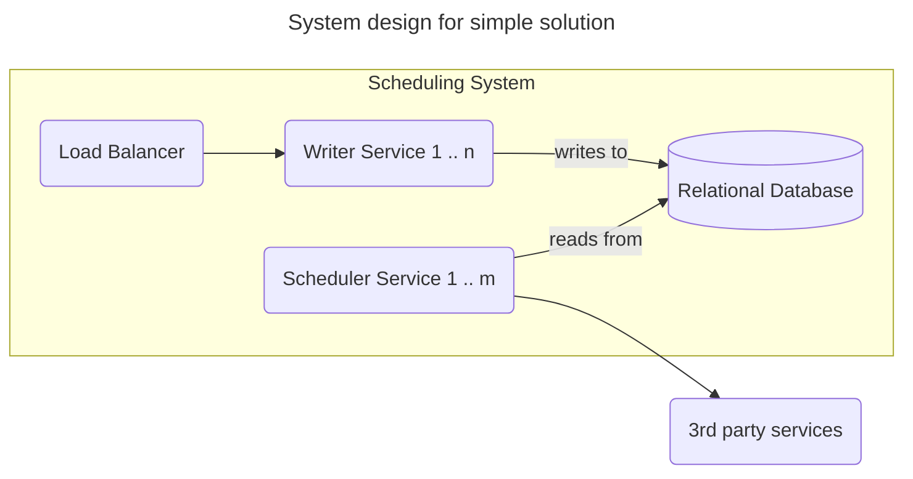
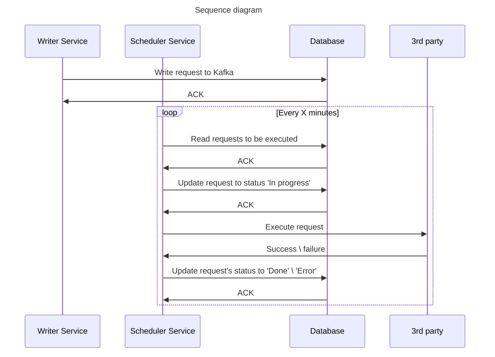
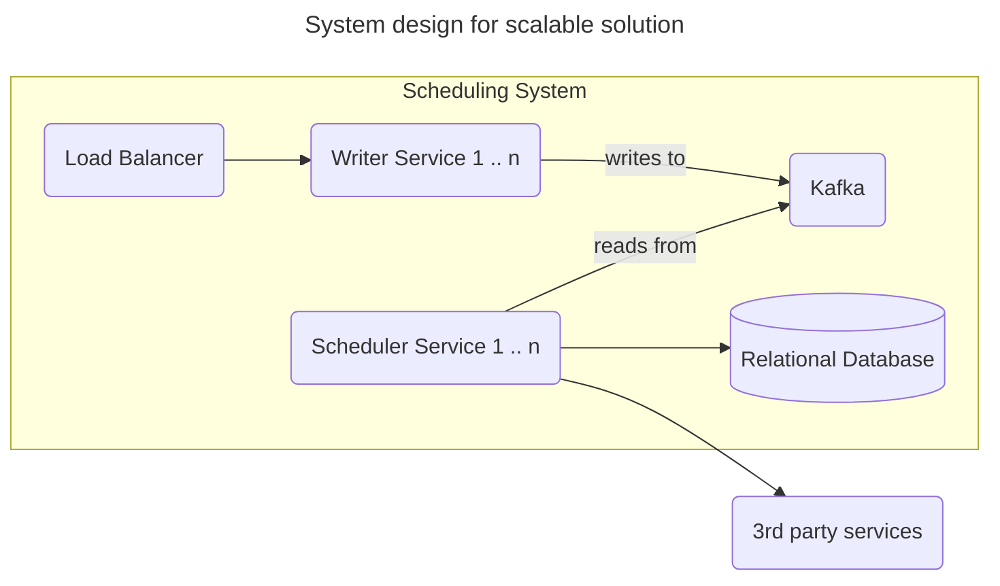
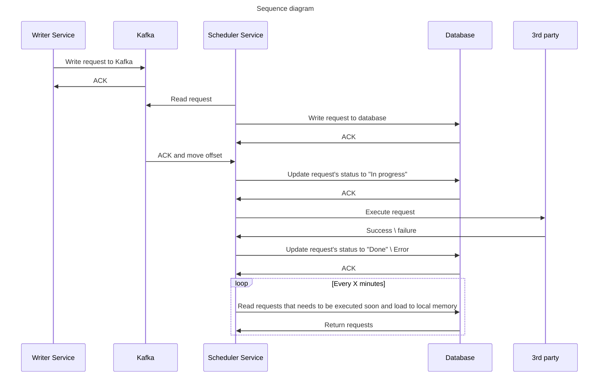
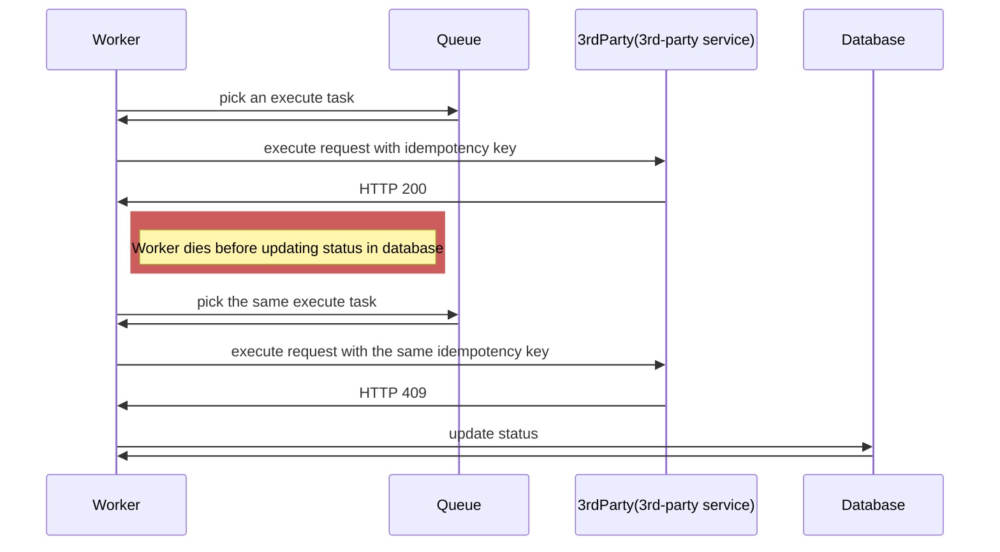

# Scheduling System

## Clarification
* What the minimal delay between scheduling request and execution?
* What is the max number of concurrent request we might need to execute?
* How much delay between provided execution date time and actual execution is acceptable?
* Do we need to expose a http resource for checking status of execution task?

## Back of envelope calculation

To get the idea about what number of requests we will store for execution lets calculate how many requests per day will we receive:
10 rpm * 60 * 24 = 14400 requests per day

## High level design

The write volume is low therefore we will not be focusing on storing data in database here. It is not a problem and any database can handle even 1000 requests per minute.

The problem boils down to coordinating which instance executes which task and how to ensure timely execution. In the simple approach we will use database ([Postgresql](https://www.postgresql.org/)) for coordination. In scalable we will use [Kafka](https://kafka.apache.org/).

### Simple solution





#### Components description

**Writer Service** - Stateless HTTP service with Load Balancer in front. Responsible for writing execution requests into a database. For each execution request it generates idempotency key which is added to the request.

**Database** - Relational database like Postgresql. The schema in this version would look like this:

```sql
create table execution_tasks(
    id BIGINT PRIMARY KEY,
    idempotency_key UUID UNIQUE,
    url TEXT,
    execution_scheduled_at TIMESTAMP,
    body TEXT,
    status TEXT,
    created_at, TIMESTAMP,
    updated_at TIMESTAMP
); 
```

**Scheduler Service** - Each instance reads every minute from database requests that need to be executed. To make sure a single request is not executed twice at the same time we will use locking mechanism. Below is the query to pull data with locking:

```sql
SELECT * FROM scheduled_jobs 
WHERE execution_time < now() and status="ToDo"
ORDER BY execution_time DESC
LIMIT 50
FOR UPDATE SKIP LOCKED;
```

To make sure we do not lock rows for too long (for example when instance dies right after calling select for update) we can add a line to our transaction where we set a timeout. It can be done in the following way:

```sql
BEGIN;
SET statement_timeout = timeout_in_milliseconds;
-- Your SQL statement with FOR UPDATE
COMMIT;
```

### Scalable solution





### Components

**Writer Service** - Stateless HTTP service with Load Balancer in front. Responsible for sending requests for execution to Kafka topic. For each execution request it generates idempotency key which is added to the request.

**Scheduler Service** - Each instance reads from Kafka's topic and store the requests in database. Before writing to db it would check the time of execution. If the execution should happen within next x minutes it would additionally store the request to a local cache (could use priority queue ordered by time of execution). This way we would not need to spend time querying database every minute to find requests that need to be executed. Instead, we keep "soon to be executed" requests in memory and add to it periodically (how often would depend on x).

**Database** - Relational database like Postgresql. The schema would look like this:
```sql
create table execution_tasks(
    id BIGINT PRIMARY KEY,
    partition_id INT,
    idempotency_key UUID UNIQUE,
    url TEXT,
    execution_scheduled_at TIMESTAMP,
    body TEXT,
    status TEXT,
    created_at, TIMESTAMP,
    updated_at TIMESTAMP
); 
```

## Writing interface

We will assume here we need support all HTTP verbs. Our interface will look as described below:

`HTTP POST https://myservice.com/schedule`

Body:
```json
{
  "url": "https://service-to-call.com/path/to/call",
  "verb": "PUT",
  "body": "{\"param1:\" 11, \"param2\": [33.4, 12.0, 54.134]}",
  "executionDateTime": ""
}
```

## Timezone handling

On API layer we would allow clients to define when request needs to be executed by providing date and time with timezone (by default we would use their current timezone).

On the database we would store everything using UTC. The transformation could happen either on backend or on database (many databases like Postgresql have types `with timezone` which accepts date time with timezone and transform it into UTC or server default timezone).

If we allow reading existing tasks (for example to check status of execution) we would return UTC based timestamp and allow client to convert to current user's timezone. 

## Handling of crashes and duplication

We will focus here only on Scalable solution.

Its worth noting that unless 3rd-party services, which we will be calling, support some sort of idempotency key for write operations then we cannot do much about avoiding duplicated calls. Our call might be handled and the response returned by the 3rd party service but due to network problems we will never receive the answer. This way from our service perspective the call will look like failed one. 

### Duplication problem

The processing of http execution task can be interrupted at any point. The interruption can happen after we call 3rd-party service but before we have a chance to go to database and update the status of the task. The reason for interruption might be problem with connectivity to database or even a crash of our worker. The only way to prevent double processing is using idempotency key. The key is unique for every task and always passed to 3rd-party service. When received service first checks if the request was already executed and if so it returns information about it without performing any logic. If the idempotency key is new then it is stored in database and request is properly handled.

### With idempotency key



### Crashes

#### Writer Service

When Writer Service crashes before writing to Kafka the client will not receive response which should be interpreted as if the request was not handled properly. 

If Writer Service crashes after writing to Kafka but before returning anything to user the request to call a service will be executed eventually but the client will not know about it and should consider the initial call as failure.

#### Scheduler Service

If Scheduler Service instance crashes after receiving a message but before writing data to database it will not move topic's offset so another instance will read the same message again.

If Scheduler Service instance crashes after writing to database but before acknowledging it to Kafka it means a different instance will read the same request again. When trying to write it to database it will cause unique constraint violation. This should be treated as indicator that the request was already persisted and there is nothing more to do here. 

If Scheduler Service instance crashes after receiving a response from 3rd party but before writing the result to database then the request will be executed again later. This is the case described in [Duplication problem section](#duplication-problem).

In all of the above cases when instance crashes a new one needs to be created. When ramping up it will connect to Kafka and received a partition number which it will read from. The partition number can be used to pull from database the requests that needs to be executed in the nearest future. They should be loaded to memory. After this the instance is ready to perform the task.

## Other topics to talk about
* How does Kafka work?
* How to defend Scheduler Service from slow \ unresponsive services that it needs to call?

## Additional resources
* ["Building a Distributed Task Scheduler With Akka, Kafka, and Cassandra" by David van Geest
  ](https://www.youtube.com/watch?v=s3GfXTnzG_Y) (which was inspiration for this design)
* [Kafka documentation](https://kafka.apache.org/20/documentation.html#gettingStarted)
* [Postgresql](https://www.postgresql.org/)
