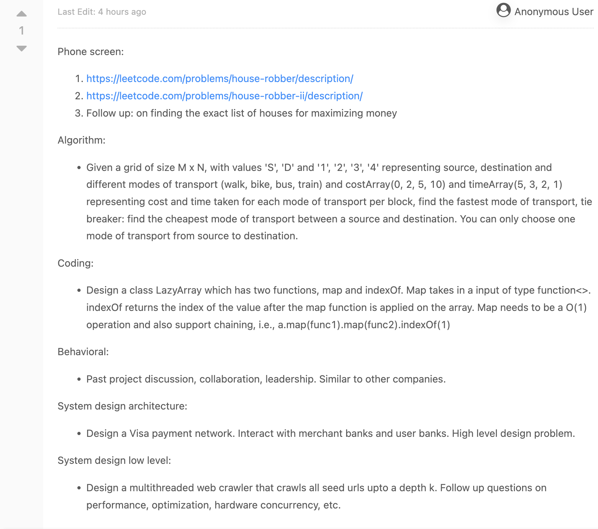

# Databricks interview questions

## Interview
[Link to Leetcode (already removed)](https://leetcode.com/discuss/interview-question/4162691/Databricks-SWE-interview-experience-or-L5-or-USA)

### Solutions

* [Phone screen House Robber problem](HouseRobber.java)
  * For testing please use Leetcode challenge [here](https://leetcode.com/problems/house-robber/).
* [Phone screen House Robber 2 problem](HouseRobber.java)
  * For testing please use Leetcode challenge [here](https://leetcode.com/problems/house-robber-ii/).
* [Lazy list implementation](LazyList.kt)
