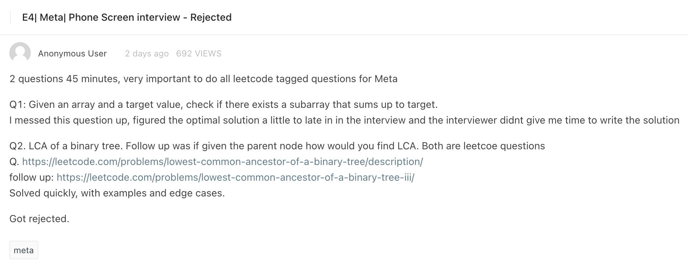

# Meta interview questions

## Interview

[Link to Leetcode](https://leetcode.com/discuss/interview-question/4259535/META-or-Random-pick-index-and-Subarray-sum-K)

### Solutions

* [Sum of subarray](SumOfSubarray.kt)
* [Random pick index](RandomPickIndex.kt)

---

[Link to Leetcode](https://leetcode.com/discuss/interview-question/4220455/E4or-Metaor-Phone-Screen-interview-Rejected)

### Solutions

* [Sum of subarray](SumOfSubarray.kt)
* [Lowest common ancestor](LowestCommonAncestor.java)
