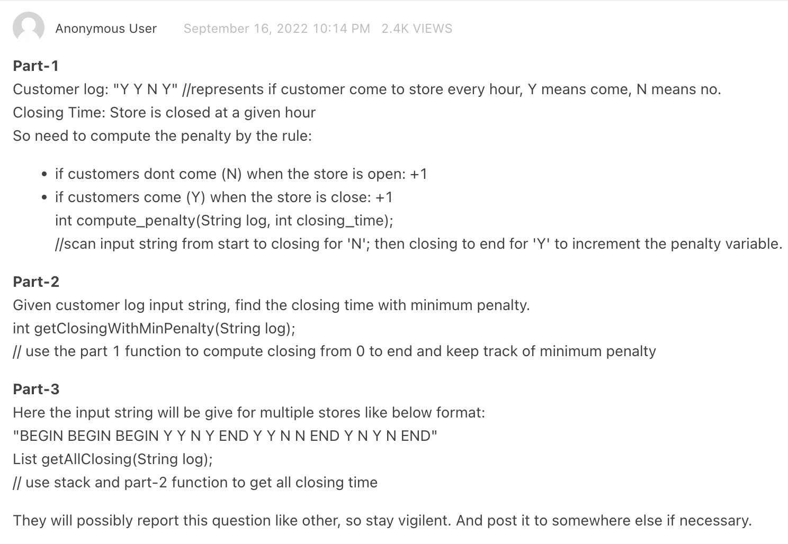

# Stripe interview questions

## Interview

[Link to Leetcode](https://leetcode.com/discuss/interview-question/2585038/Stripe-or-Phone-Screen-or-Senior-SE-or-Reject)

### My experience
During my interview with Stripe I had an alternative version of part-3. In my version the task was to implement `get_best_closing_times`. The method would take a polluted log and had to scan for valid sequences of opening hours. For eahc valid sequence it would need to calculate best closing time in return them on a list.

Example input: `Y Y Y BEGIN Y Y Y Y BEGIN Y Y \n Y Y Y END Y BEGIN Y Y Y BEGIN \n Y Y Y Y BEGIN Y Y Y END`

### Solutions

* [Part 1](ShopOpeningTimeProblem.kt#L14)
* [Part 2](ShopOpeningTimeProblem.kt#L27)
* For Part 3 solution depends if the time windows should be ordered based on opening or ending time.
  * [Based on opening](ShopOpeningTimeProblem.kt#L41)
  * [Based on closing](ShopOpeningTimeProblem.kt#L64)
